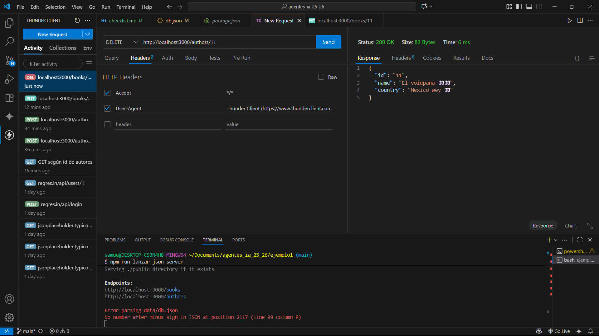

# CHECKLIST - semana 02 -

## **CRUD CON THUNDER CLIENT**

- [X] Create ***POST*** **Creamos el libro y autor cuya id es 11**
### Con libro id 11

### Con Autores id 11

- [X] read  ***GET*** **Pedimos el libro y autor cuya id es 2**

- [x] Update
### Con libro id 11

### Con Autores id 11

- [x] Delete
### Con libro id 11

### Con Autores id 11

## CRUD CON SCRIPT/CURL

- [] Create

- [] read

- [] Update

- [] Delete